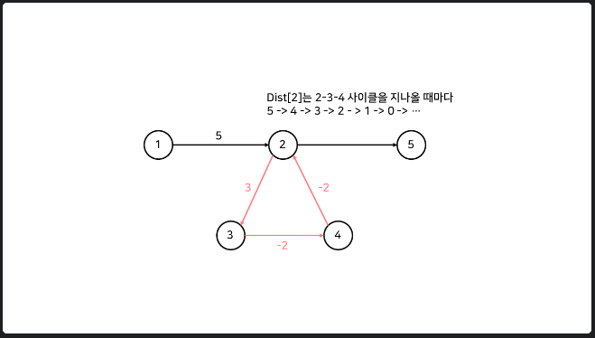

# 11.7

- **LCS (Logest Common Substring) or (Longest Common Subsequence)**
    - **최장 공통 문자열(Longest Common Substring)**
      
        ```python
        if i == 0 or j == 0:  # 마진 설정
        	LCS[i][j] = 0
        elif string_A[i] == string_B[j]:
        	LCS[i][j] = LCS[i - 1][j - 1] + 1
        else:
        	LCS[i][j] = 0
        ```
        
        1. **마진 설정**
            1. 값을 이용하는 dp 형태로 연산을 진행하기 때문에 기본 값을 만드는 행열이 필요하다.
        2. **연산**
            1. 조건1 : i, j의 위치에서 각 문자가 일치하는 경우
                - 최장 공통 문자열의 길이를 구하는 것이므로, 바로 전 문자열에서 이어지는 값 + 1을 해주어야 한다.
            2. 조건2 : 일치하지 않는 경우
                - 해당 i, j 번째의 문자는 0
    - **최장 공통 부분수열(Longest Common Subsequence)**
      
        ```python
        if i == 0 or j == 0:  # 마진 설정
        	LCS[i][j] = 0
        elif string_A[i] == string_B[j]:
        	LCS[i][j] = LCS[i - 1][j - 1] + 1
        else:
        	LCS[i][j] = max(LCS[i - 1][j], LCS[i][j - 1])
        ```
        
        1. **마진 설정**
            1. 값을 이용하는 dp 형태로 연산을 진행하기 때문에 기본 값을 만드는 행열이 필요하다.
        2. **연산 : 공통 문자열과 다른 점 하나**
            1. **조건1 : i, j의 위치에서 각 문자가 일치하는 경우**
                - 최장 공통 문자열의 길이를 구하는 것이므로, 바로 전 문자열에서 이어지는 값 + 1을 해주어야 한다.
            2. **조건2 : 일치하지 않는 경우**
                - 전 과 달리 부분 수열이므로
                    - 현재 위치의 i, j 문자가 같지 않으므로 이 문자를 뺀 수열끼리 비교한다.
                        - Ex. AB, GBC를 비교하고 있다고 생각해 보자.
                            - B 와  C가 일치하지 않으므로
                                - case 1 : AB , GB(C)
                                - case 2: A, GBC
                                - 위 2 경우에서 지금까지 가장 긴 부분수열 값을 택해서 이 위치에 저장시킨다.

- **가로 세로 정렬 CSS**
    - **display : flex;**
        - inline-flex로 바뀐다. → inline 으로 인식된다.
    - **margin: auto;**
        - 마진은 가로 방향 가운데 정렬밖에 해줄 수 없다.
        - 세로 방향은 margin을 따로 설정해 주거나,
        - flex 요소에서 justify-content-center 와 align-items-center를 둘 다 주어야 한다.

### 최단경로 알고리즘

- **다익스트라 알고리즘**
    - 매번 방문하지 않은 노드 중에서 최단 거리가 가장 짧은 노드를 선택하여 한 단계씩 최단 거리를 구해나간다.

- **벨만 포드 알고리즘 : O(VE)**
    - **음의 사이클이 없는 그래프에서만 적용할 수 있다.**
        - 음의 사이클 존재 여부를 파악할 수 있다.
            - **V - 1 개의 간선보다 더 많은 간선을 통해 최단 경로를 구하는 경우, 음의 사이클이 존재한다.**
    - (정점 - 1)번의 매 단계마다 모든 간선을 전부 확인하면서 모든 노드 간의 최단 거리를 구해나간다.
    - 다익스트라와 비교하여 매 반복마다 모든 간선을 확인한다는 차이점이 있다.
    
    - **동작 과정**
        1. 출발 노드를 설정한다.
        2. 최단 거리 테이블을 초기화한다.
        3. 다음의 과정을 (정점(V) - 1) 번 반복한다.
            1. 모든 간선 E 개를 하나씩 확인한다.
            2. 각 간선을 거쳐 다른 노드로 가는 비용을 계산하여 최단 거리 테이블을 갱신한다.
        - 만약 음수 간선 순환(싸이클)이 발생하는지 체크하고 싶다면 3번 과정을 한번 더 수행한다.
          
            ⇒ 이 때, 최단 거리 테이블이 갱신 된다면 음수 간선 순환이 존재하는 것이다.
            
            
            
            - 빨간 선의 가중치 합이 -1이다.
            - 따라서, 사이클을 반복할 수록 거리는 작아지게 된다.
            - **이를 판별하기 위해, 한 노드에서 다른 노드까지의 최단 경로를 많아봐야 V - 1개의 간선을 지난다는 가정을 세운다.**
              
                → 이 보다 많은 간선을 지나면, 음의 사이클이 존재한다는 의미이다.
                
    
    - 초기화 작업 : O(V)
    - 음의 가중치 사이클 검사 : O(E)
    - **코드**
      
        ```python
        def bellmanFord(start):
            global N, M, INF
            # 시작 노드 초기화
            distance[start] = 0
            # N - 1 번 탐색하고 마지막 한 번은 Negative cycle 존재 확인 (N 번째에도 갱신된다면 음수 사이클임)
            for i in range(N):
                for j in range(M):
                    A, B, C = graph[j] # A to B , 거리 C
                    if distance[A] != INF and distance[A] + C < distance[B]:
                        distance[B] = distance[A] + C
                        if i == N - 1: # N 번 째에 값이 갱신된 거라면
                            return False
            return True
        
        import sys
        input = sys.stdin.readline
        
        N, M = map(int, input().split()) # N 개의 정점, M 개의 간선
        graph = [list(map(int, input().split())) for _ in range(M)] # 간선 정보
        
        INF = int(1e9)
        distance = [INF] * (N + 1)
        
        if bellmanFord(1):
            for i in range(2, N + 1):
                tmp = distance[i]
                if tmp == INF: # 경로가 없다면
                    print(-1)
                else:
                    print(tmp)
        else: # 싸이클 발생
            print(-1)
        ```
        

- **플로이드-워셜 알고리즘: O(n^3)**
    - 모든 최단 경로를 구하는 알고리즘
    - 다익스트라 알고리즘과는 다르게 음의 간선도 사용할 수 있다.
    
    - **동작과정**
        - 2차원 인접 행렬을 구성한다.
            - 자기 자신은 거리가 0으로 초기화 한다.
        - 각 간선에 대한 정보를 입력 받아 인접 행렬에 등록
        - **‘**A에서 B로 가는 최소 비용'과 ‘A에서 K를 거쳐 B로 가는 비용'을 비교하여, 더 작은 값으로 갱신한다.