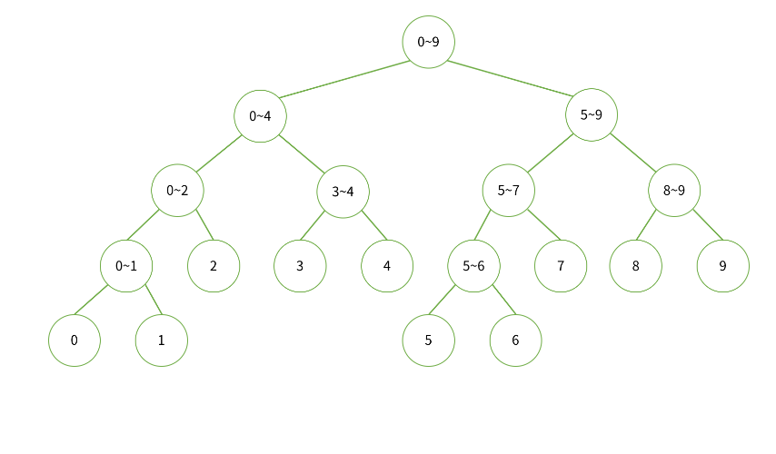

# 12.15 [세그먼트 트리]

- **세그먼트 트리**
  
    참조 : [https://cheon2308.tistory.com/entry/자료구조-세그먼트-트리Segment-Tree](https://cheon2308.tistory.com/entry/%EC%9E%90%EB%A3%8C%EA%B5%AC%EC%A1%B0-%EC%84%B8%EA%B7%B8%EB%A8%BC%ED%8A%B8-%ED%8A%B8%EB%A6%ACSegment-Tree)
    
    - 이용
        - 구간합을 구할 때 이용
        - 트리의 각 노드의 값은 구간에서의 합, 차, 최솟값, 최댓값 등의 집계함수 요소들의 값이 있다.
        - 따라서 a ~ b 사이의 구간에 대한 집계함수를 이용할 때 사용 가능하다.
    
    - 백준 문제 : [최솟값과 최댓값](https://www.acmicpc.net/problem/2357)
        - 풀이
          
            ```python
            def make_tree(left, right, i): # 범위 정보 (left ~ right), 트리 노드 번호 i
                if left == right:
                    tree[i][0], tree[i][1] = arr[left], arr[left]
                    return tree[i]
                mid = (left + right) // 2
                left = make_tree(left, mid, i * 2)
                right = make_tree(mid + 1, right, i * 2 + 1)
                tree[i] = [min(left[0], right[0]), max(left[1], right[1])]
                return tree[i]
            
            def find_value(left, right, i, s, e): # 탐색 범위 (left, right), tree 노드번호 idx, 결과 범위 (s, e)
                if left > e or right < s: # 결과 범위를 벗어난 영역을 탐색 중
                    return (int(1e9), 0)
                if s <= left and right <= e: # 결과 범위 안의 탐색 영역일 경우 값을 택함
                    return (tree[i][0], tree[i][1])
                mid = (left + right) // 2
                left = find_value(left, mid, i * 2, s, e)
                right = find_value(mid + 1, right, i * 2 + 1, s, e)
                return (min(left[0], right[0]), max(left[1], right[1]))
            
            import sys
            input = sys.stdin.readline
            
            from math import log, ceil
            N, M = map(int, input().split())
            arr = [int(input()) for _ in range(N)]
            h = ceil(log(N, 2))
            size = 2 ** (h + 1)
            tree = [[0, 0] for _ in range(size)] # 구간 [최솟값, 최댓값]
            # 세그먼트 트리 만들기
            make_tree(0, N - 1, 1)
            
            for _ in range(M):
                a, b = map(int, input().split())
                min_v, max_v = find_value(0, N - 1, 1, a - 1, b - 1)
                print(min_v, max_v)
            ```
            
            - 처음에는 재귀함수를 다음과 같이 썼는데 시간초과가 났다.
              
                ```python
                def make_tree(left, right, i): # 범위 정보 (left ~ right), 트리 노드 번호 i
                    if left == right:
                        tree[i][0], tree[i][1] = arr[left], arr[left]
                        return tree[i]
                    mid = (left + right) // 2
                    tree[i][0] = min(make_tree(left, mid, i * 2)[0], make_tree(mid + 1, right, i * 2 + 1)[0])
                    tree[i][1] = max(make_tree(left, mid, i * 2)[1], make_tree(mid + 1, right, i * 2 + 1)[1])
                    return tree[i]
                
                def find_value(left, right, i, s, e): # 탐색 범위 (left, right), tree 노드번호 idx, 결과 범위 (s, e)
                    if left > e or right < s: # 결과 범위를 벗어난 영역을 탐색 중
                        return (int(1e9), 0)
                    if s <= left and right <= e: # 결과 범위 안의 탐색 영역일 경우 값을 택함
                        return (tree[i][0], tree[i][1])
                    mid = (left + right) // 2
                    min_v = min(find_value(left, mid, i * 2, s, e)[0], find_value(mid + 1, right, i * 2 + 1, s, e)[0])
                    max_v = max(find_value(left, mid, i * 2, s, e)[1], find_value(mid + 1, right, i * 2 + 1, s, e)[1])
                    return (min_v, max_v)
                
                import sys
                input = sys.stdin.readline
                
                from math import log, ceil
                N, M = map(int, input().split())
                arr = [int(input()) for _ in range(N)]
                h = ceil(log(N, 2))
                size = 2 ** (h + 1)
                tree = [[0, 0] for _ in range(size)] # 구간 [최솟값, 최댓값]
                # 세그먼트 트리 만들기
                make_tree(0, N - 1, 1)
                
                for _ in range(M):
                    a, b = map(int, input().split())
                    min_v, max_v = find_value(0, N - 1, 1, a - 1, b - 1)
                    print(min_v, max_v)
                ```
                
                - 이 코드의 경우, 재귀 호출 중에 직접 값을 할당하며,
                    - 통과한 코드에서는 재귀 호출 이후에 값을 할당한다.
                - 직접적인 이유는 아직 모르겠다…
                - 두 번째 버전에서는 **`make_tree`** 함수 내에서 두 번의 재귀 호출로 최솟값과 최댓값을 계산합니다.
                - 이로 인해 중복 계산이 발생할 수 있습니다. 첫 번째 버전에서는 최솟값과 최댓값을 한 번만 계산하여 트리에 할당합니다.
                - 중복 계산은 성능에 영향을 줄 수 있으며, 이는 두 번째 버전이 더 많은 계산을 수행할 수 있음을 의미합니다.
            
            - 세그먼트 트리 원리 (top-down)
                - 이진트리 구조를 가지고 있다.
                    - 선형 탐색보다 좀 더 효율적인 탐색이 가능하다.
                    - 특히, 누적합의 경우 특정 데이터 변경 시 O(N)으로 업데이트
                    - 세그먼트 트리는 **`O(logN)`**으로 반영 => **최악의 경우 `O(NlogN)`**
                - 각 구간에 대해서 반 씩 분할해서 자식 노드로 할당 한다.
                    - 자식 노드의 값으로는 해당 범위에서의 집계 함수 값을 기입한다.
                
                - 트리의 총 높이는 h = log(N) (올림) 으로 구할 수 있다.
                - 트리 배열의 총 길이 size = 2 ^(h + 1) - 1 ⇒ [0] + [0] * size
                
                
                
                - 이러한 형태로 범위가 지정된 다고 생각할 수 있다.
                - 트리의 구성
                  
                    ```python
                    def make_tree(left, right, i): # 범위 정보 (left ~ right), 트리 노드 번호 i
                        if left == right:
                            tree[i][0], tree[i][1] = arr[left], arr[left]
                            return tree[i]
                        mid = (left + right) // 2
                        left = make_tree(left, mid, i * 2)
                        right = make_tree(mid + 1, right, i * 2 + 1)
                        tree[i] = [min(left[0], right[0]), max(left[1], right[1])]
                        return tree[i]
                    ```
                    
                    - 분할 정복 처럼 범위를 분할해 가며 이진트리 형태로 왼쪽 부터 값을 채우며 진행한다.
                - 트리의 탐색
                  
                    ```python
                    def find_value(left, right, i, s, e): # 탐색 범위 (left, right), tree 노드번호 idx, 결과 범위 (s, e)
                        if left > e or right < s: # 결과 범위를 벗어난 영역을 탐색 중
                            return (int(1e9), 0)
                        if s <= left and right <= e: # 결과 범위 안의 탐색 영역일 경우 값을 택함
                            return (tree[i][0], tree[i][1])
                        mid = (left + right) // 2
                        left = find_value(left, mid, i * 2, s, e)
                        right = find_value(mid + 1, right, i * 2 + 1, s, e)
                        return (min(left[0], right[0]), max(left[1], right[1]))
                    ```
                    
                    - 누적합 형태던 최소, 최대값을 구하는 형태던 탐색을 파고 들었을 때,
                    최종목표하는 범위 안에 탐색 범위가 들어 있다면 연산 해주면 된다.
                    - 범위를 벗어나는 경우에는 종료해 준다.
                        - 누적합 이면 0
                        - 최소, 최대면 최소(최대)일 때는 최대 값(최소값)을 넣어서 결과에 영향을 주지 않게끔 한다.