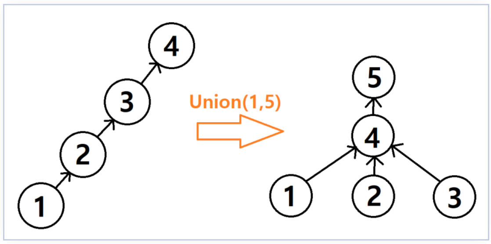

# 1.1 [유니온 - 파인드]

- **유니온 - 파인드 경로압축**
    - 경로 압축을 해서 find를 할 경우, 마지막에 다시 find_set 과정을 통해 부모를 다시 합쳐줘야 한다.
    - 참조 사이트 : [https://blogshine.tistory.com/103](https://blogshine.tistory.com/103)
    
    
    
    - 위와 같은 트리가 생성 됐다고 하고
        - union (1, 5)를 실행했다고 하자.
            - 그러면 find_set(5) = 5 이고,
            - 그 전에는 parent 정렬이 안됐다고 생각하고 find_set(1)을 실행하면 4번 root로 경로 압축이된다. 이 압축 된게 5 번에 붙은 식으로 트리가 형성된다.
            - 따라서 가장 마지막에 실행한 트리 구조가 새롭게 편성된 트리라면 len(set(parent))로 판단할 때, 집합 개수가 하나 더 있는 것처럼 보인다.
    - **따라서 마지막에 발생하는 것을 보정하기 위해서 마지막 부분에 대해서 다시 경로 압축을 해주는 것이 좋다.**

- [네트워크](https://school.programmers.co.kr/learn/courses/30/lessons/43162)
  
    ```python
    def solution(n, computers):
        parent = [i for i in range(n)]
        
        def find_set(x):
            if parent[x] == x:
                return x
            parent[x] = find_set(parent[x])
            return parent[x]
        
        def union(x, y):
            x = find_set(x)
            y = find_set(y)
            
            if x == y:
                return
            
            if x > y:
                parent[x] = y
            else:
                parent[y] = x
        
        for i in range(n):
            for j in range(n):
                if i == j or computers[i][j] == 0:
                    continue
                union(i, j)
    
    		# 보정해 주기
        for i in range(n):
            find_set(i)
        answer = len(set(parent))
        return answer
    ```