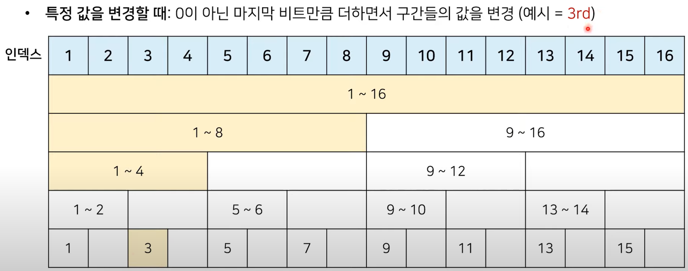
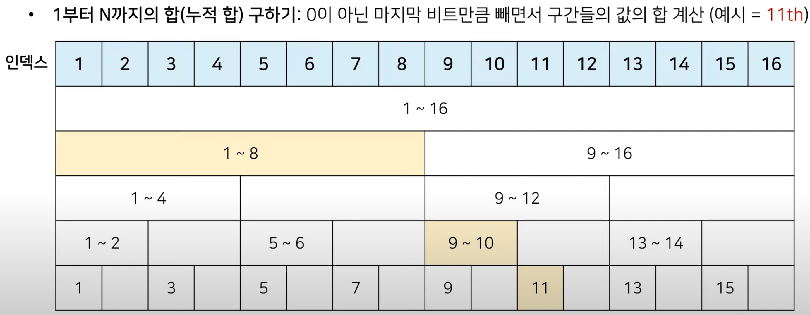

# 5.28 [펜윅트리]

## **백준문제(교차개수세기)**

[교차개수세기](https://www.acmicpc.net/problem/1615)

[7578번 공장(Fenwick tree, python)](https://juhongyee.tistory.com/15)

[백준 #2042 구간 합 구하기 (파이썬) : 세그먼트 트리, 펜윅 트리 두가지 풀이](https://velog.io/@yoopark/baekjoon-2042)

## **펜윅트리**

### K & -K 연산

파이썬에서 비트 연산 `K & -K`는 특정한 성질을 이용하여 특정 값을 빠르게 구할 수 있는 테크닉 중 하나입니다. 이를 이해하기 위해서는 이 연산의 배경과 동작 방식을 상세히 알아야 합니다.

### 기본 개념

- **비트 연산**: 숫자들을 2진수로 표현하고, 각 자리(bit)에 대해 AND(&), OR(|), XOR(^), NOT(~) 등의 연산을 수행하는 방법입니다.
- **음수 표현**: 파이썬은 숫자를 2의 보수(complement) 형태로 표현합니다. 2의 보수는 이진수의 모든 비트를 뒤집고(0은 1로, 1은 0으로) 1을 더한 값입니다.

### K의 의미

정수 K의 음수 -K를 구하려면 2의 보수를 사용해야 합니다. 예를 들어, 10진수 5를 2진수로 표현하면 `0101`입니다. 이 값을 2의 보수로 변환하는 과정은 다음과 같습니다:

1. 비트 반전: `0101` -> `1010`
2. 1을 더함: `1010` + `1` = `1011`

따라서, 5의 음수인 -5는 `1011`로 표현됩니다.

### K & -K 연산

`K & -K`는 특정 비트 연산을 수행하여 주어진 정수 K의 최하위 비트(LSB: Least Significant Bit)에서 1인 위치를 찾습니다.

이 연산의 결과는 다음과 같습니다:

1. **K의 2진 표현에서 최하위 비트 1의 위치만 남기고 나머지는 모두 0으로 만듭니다.**

### 예제

예를 들어, K가 12인 경우:

1. K = 12는 2진수로 `1100`입니다.
2. K를 구합니다:
    - K의 반전: `1100` -> `0011`
    - 1을 더함: `0011` + `1` = `0100` (즉, -12는 `0100`)
3. 이제 `K & -K`를 계산합니다:
    - `1100` & `0100` = `0100` (즉, 4)

이 결과는 12의 2진수 표현에서 최하위 비트가 1인 위치를 의미합니다.

### 또 다른 예제

K가 18인 경우:

1. K = 18는 2진수로 `10010`입니다.
2. K를 구합니다:
    - K의 반전: `10010` -> `01101`
    - 1을 더함: `01101` + `1` = `01110` (즉, -18는 `01110`)
3. 이제 `K & -K`를 계산합니다:
    - `10010` & `01110` = `00010` (즉, 2)

이 결과는 18의 2진수 표현에서 최하위 비트가 1인 위치를 의미합니다.

### 활용

- **최하위 비트 추출**: `K & -K`는 주로 최하위 비트 추출에 사용됩니다. 이는 비트 마스크로 특정 비트를 빠르게 찾을 때 유용합니다.
- **비트 조작 알고리즘**: 예를 들어, 집합에서 특정 원소를 찾거나, 이진수의 특정 패턴을 처리하는 알고리즘에서 활용될 수 있습니다.
- **효율적 연산**: O(1) 시간 복잡도로 최하위 비트를 찾을 수 있어, 특정 비트 연산에서 매우 효율적입니다.

### 결론

`K & -K`는 비트 연산을 활용하여 주어진 숫자의 최하위 비트 위치를 효율적으로 찾는 방법입니다. 이는 컴퓨터 과학과 프로그래밍에서 비트 레벨 조작을 할 때 매우 유용하게 쓰입니다. 이 테크닉을 이해하고 활용하면 특정 문제를 더 빠르고 간결하게 해결할 수 있습니다.

- tree 생성
  
    ```python
    tree = [0]*(N+1)
    ```
    
- **update :** `O(logn)`
  
    ```python
    def update(i, diff):
        while i <= N:
            tree[i] += diff
            i += (i & -i)
    ```
    
    
    
- **prefix_sum :** `O(logn)`
  
    ```python
    # [1, i]의 누적합
    def prefix_sum(i):
        answer = 0
        while i > 0:
            answer += tree[i]
            i -= (i & -i)
        return answer
    ```
    
    
    
- **[A, B]의 누적합 : (1 - B 까지의 누적합) - (1 - A - 1 까지의 누적합)**
  
    ```python
    def interval_sum(start, end):
        return prefix_sum(end) - prefix_sum(start-1)
    ```