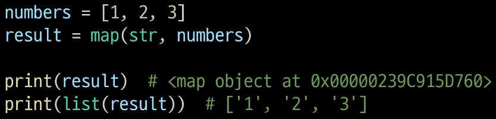

# 7.19

날짜: 2023년 7월 19일

시퀀스 간의 연산에서 + 는 결합을 의미한다.

**🔳 유용한 내장 함수**

**🔹 map(function, iterable)**

순회 가능한 데이터구조(iterable)의 모든 요소에 함수를 적용하고, **그 결과를 map object로 반환**



→ map 결과 값을 ‘형변환’ 해줘야 한다.(단일 값일 경우)

N, M, K = map(int, input().split()) → N, M, K는 파이썬에서 튜플로 패킹을 하기 때문에 형 변환 하지 않아도 된다.

- f-string 안에서 dict 표기

```python
user_info = {'name' : 'junsik', 'age' : 30, 'address' : 'let'}
print(f'hello {user_info["name"]}')
```

dict[키]

→ 키 값이 문자열일 경우 큰따옴표(””)를 사용하여 표현해 준다.

- import

```python
from book import decrease_book

import book(.py)
book.decrease_book
```

파이썬파일(book.py) 의 경우, from 절 뒤에 쓰고

import절 뒤에 함수를 쓴다.

- map

```python
name = ['김시습', '허균', '남영로', '임제', '박지원']
age = [20, 16, 52, 36, 60]
address = ['서울', '강릉', '조선', '나주', '한성부']

info_list = list(map(create_user, name, age, address)) # map(함수, iterables 나열)
```

→ map의 형식은 map(함수, iterables를 나열) 하면 된다.

- 함수

함수에서 return 값을 필수적으로 등록해주지 않아도 된다.

- dictionary for문
1. 일반적 for (key값 할당)
   
    ```python
    >>> a = {'alice': [1, 2, 3], 'bob': 20, 'tony': 15, 'suzy': 30}
    >>> for key in a:
    ...     print(key)
    ... 
    alice
    bob
    tony
    suzy
    ```
    
2. value값으로 반복
   
    ```python
    >>> for val in a.values():
    ...     print(val)
    ... 
    [1, 2, 3]
    20
    15
    30
    ```
    
3. key와 value를 한꺼번에 반복
   
    ```python
    >>> for key, val in a.items():
    ...     print("key = {key}, value={value}".format(key=key,value=val))
    ... 
    key = alice, value=[1, 2, 3]
    key = bob, value=20
    key = tony, value=15
    key = suzy, value=30
    ```
    

- list(map(함수, iterables)))

```python
def create_user(name, age, address):
    print(f'{name}님 환영합니다!')
    increase_user()
    age = int(age)
    user_info = {'name' : name, 'age' : age, 'address' : address}
    return user_info

many_user = list(map(create_user, name, age, address))
```

📌 **꼭 기억하자!!**

**→ map 실행할 때, map 내의 함수 안에 print가 있을 경우, 일단 함수가 실행되면서 출력이 된다.**

- 내장함수
1. bool(x)
   
    x가 [], (), {}와 같이 비어 있거나 0, None이면 False
    
    이외에는 True
    

- print()

: 프린트 함수는 반환 값이 없다!

※ 함수 선언할 때 return을 선언하지 않으면 return값으로 ‘None’값을 자동으로 부여한다.